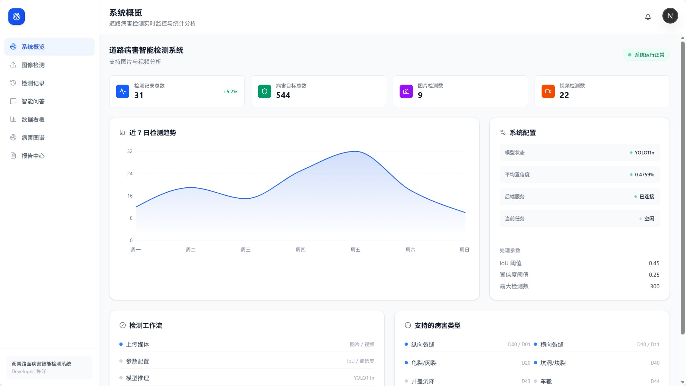
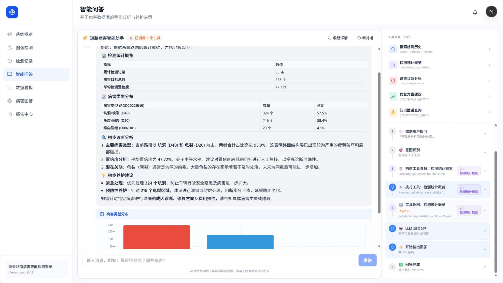
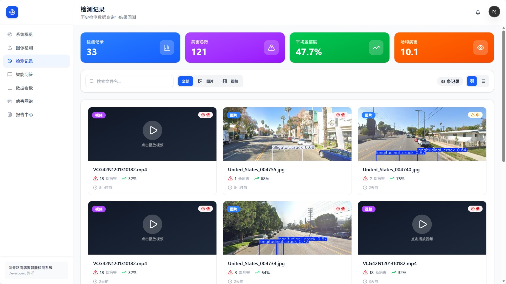
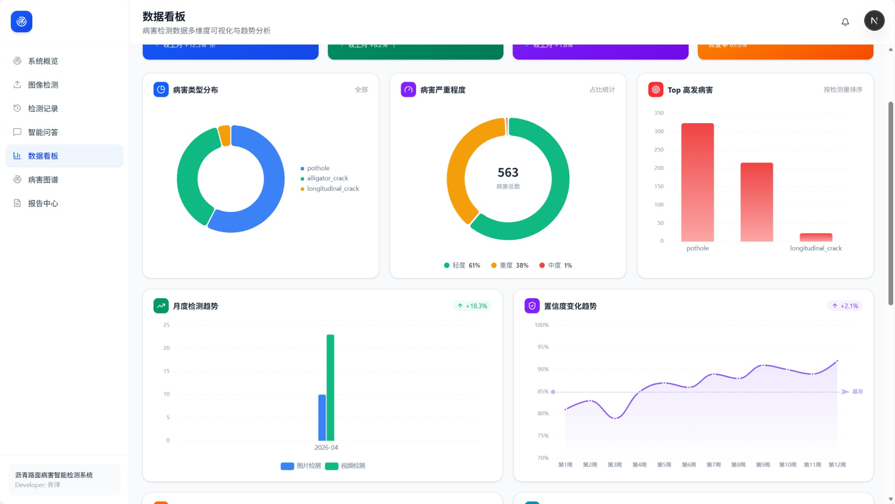
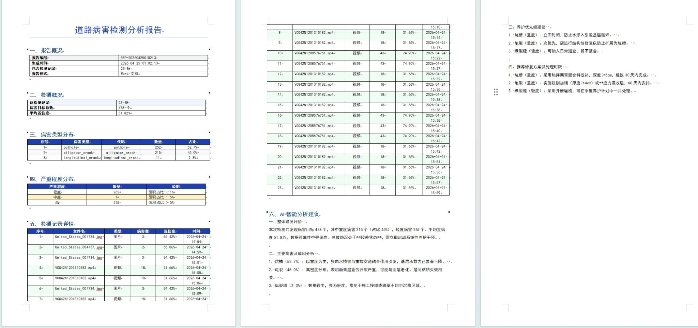
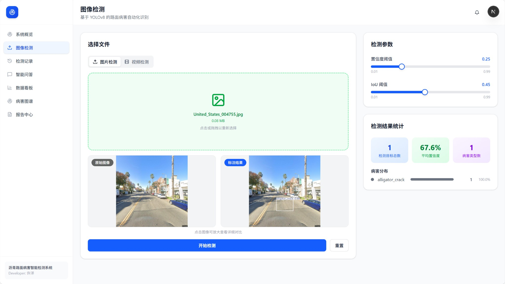
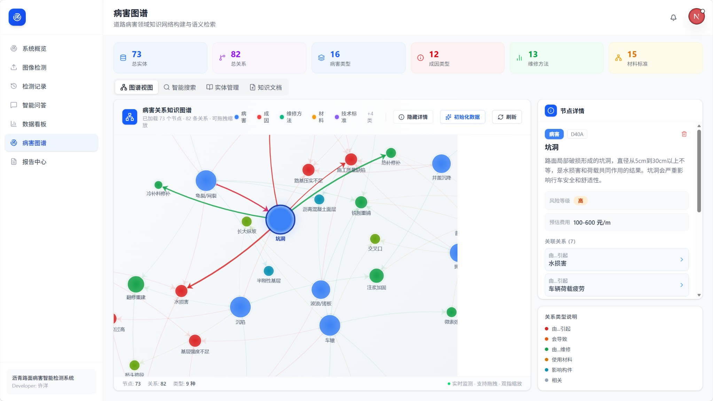
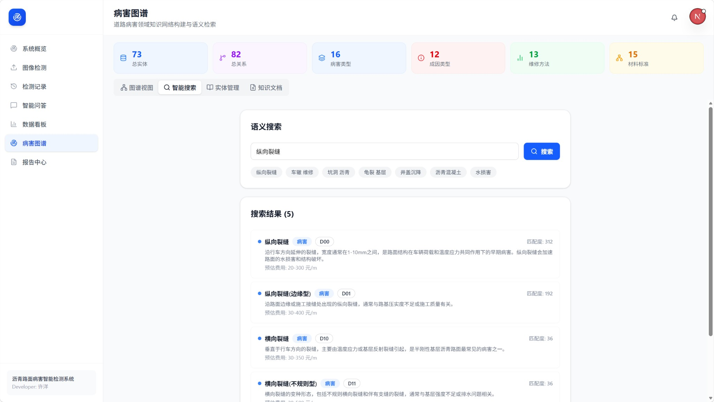
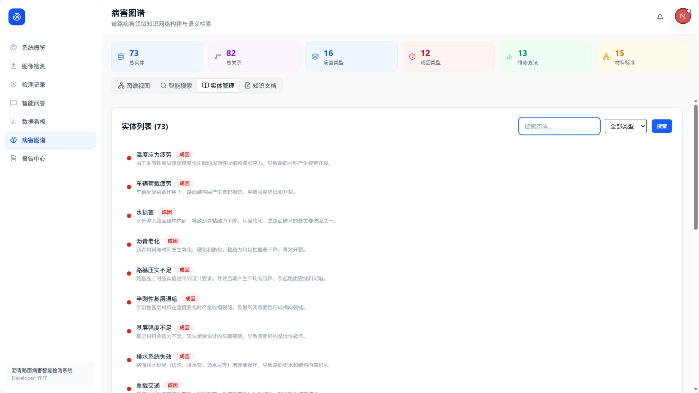
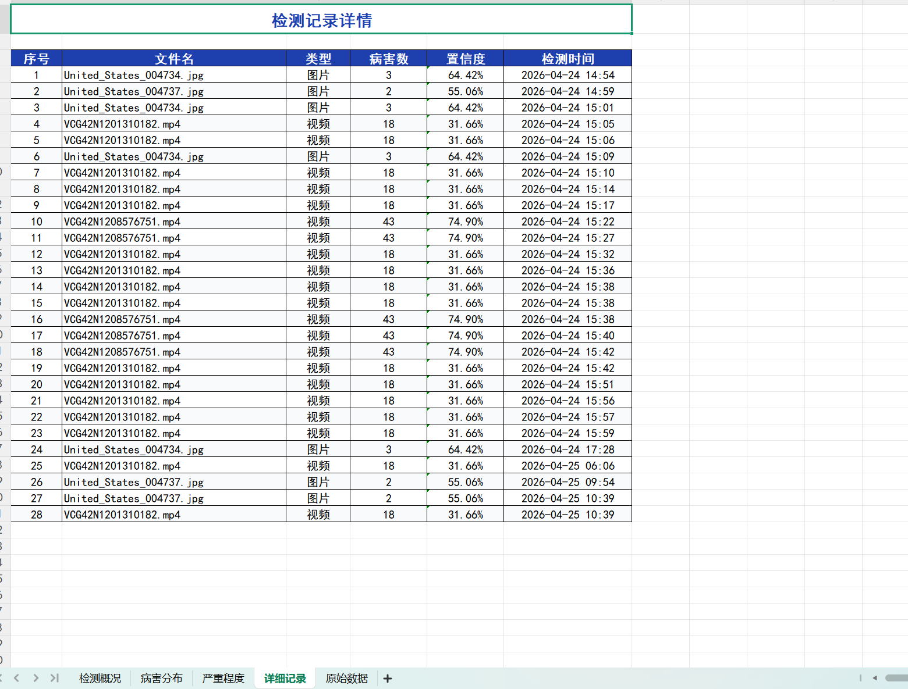

# Road Damage Detection System

<div align="center">


**基于 YOLO11n + DeepSeek + 知识图谱的道路病害智能检测与管理系统**

[English](./README_EN.md) | 简体中文

</div>

---

## 项目演示

### 系统演示视频

[](https://github.com/ZhouXuan-Yu/road-damage-detection-system-/releases/download/v1.0.0/20260430-0618-53.3180326.mp4)

> **直接观看**: 视频约161MB，点击上方按钮下载后在本地播放。

### 功能截图

| 功能模块 | 截图说明 |
|---------|---------|
| 首页 | 系统主界面，展示数据看板和快捷入口 |
| 路面检测 | 图片/视频病害检测功能界面 |
| 历史记录 | 检测历史列表，支持筛选和查看详情 |
| 数据分析看板 | 多维度统计图表，可视化展示检测数据 |
| AI助手 | 基于DeepSeek的智能问答助手 |
| 病害图谱 | 知识图谱可视化展示 |
| 病害图谱搜索 | 智能搜索病害关联信息 |
| 报告中心 | PDF/Word/Excel报告生成功能 |
| Excel报告 | 检测结果Excel导出（含五种数据） |
| Word报告 | 检测结果Word导出（含五种数据+AI建议） |













---

## 项目简介

道路病害智能检测系统是一个功能完整的 Web 应用，实现了道路路面病害的自动化检测、智能化分析和可视化报告生成。系统采用 YOLO8n 深度学习模型进行目标检测，结合 DeepSeek LLM 实现 AI 智能诊断，并利用知识图谱技术构建病害关系网络，为道路养护提供科学决策支持。

### 核心特性

-  **实时检测**: 支持图片和视频的实时病害检测，采用 YOLO11n 模型
-  **AI 智能诊断**: 基于 DeepSeek LLM 的自然语言交互和病害分析
-  **数据分析**: 多维度统计图表，病害趋势可视化
-  **知识图谱**: RDD2022 病害知识网络，关联分析
-  **报告生成**: 支持 PDF/Word/Excel 多格式专业报告


---

## 技术架构

```
┌─────────────────────────────────────────────────────────────────┐
│                         Frontend (Next.js 16)                   │
│  ┌──────────┐ ┌──────────┐ ┌──────────┐ ┌──────────────────┐    │
│  │ Detection │ │  History │ │  AI Chat │ │  Statistics      │    │
│  │ Image/Video│ │   CRUD  │ │  Agent   │ │  Charts          │    │
│  └──────────┘ └──────────┘ └──────────┘ └──────────────────┘    │
│                    TailwindCSS + shadcn/ui + Zustand            │
└───────────────────────────────┬─────────────────────────────────┘
                                │ REST API / SSE
┌───────────────────────────────┴─────────────────────────────────┐
│                        Backend (FastAPI)                         │
│  ┌──────────────┐  ┌──────────────┐  ┌──────────────────────┐   │
│  │ YOLO Service │  │  LLM Agent   │  │  Report Generator    │   │
│  │  Detection   │  │  DeepSeek    │  │  PDF/Word/Excel      │   │
│  └──────────────┘  └──────────────┘  └──────────────────────┘   │
│  ┌──────────────┐  ┌──────────────┐  ┌──────────────────────┐   │
│  │   SQLite    │  │    Neo4j     │  │   File Storage       │   │
│  │  Database   │  │  Knowledge   │  │   uploads/results     │   │
│  └──────────────┘  └──────────────┘  └──────────────────────┘   │
└─────────────────────────────────────────────────────────────────┘
```

### 技术栈

| 层级 | 技术 | 说明 |
|------|------|------|
| **前端框架** | Next.js 16.2.4 | React 19, App Router |
| **UI 组件** | shadcn/ui + Radix | 现代化组件库 |
| **样式方案** | Tailwind CSS v4 | 原子化 CSS |
| **状态管理** | Zustand | 轻量级状态管理 |
| **图表库** | ECharts / Recharts | 数据可视化 |
| **后端框架** | FastAPI 0.115+ | 高性能 ASGI 框架 |
| **数据库** | SQLite (开发) / PostgreSQL (生产) | 异步 ORM (SQLAlchemy 2.0) |
| **知识图谱** | Neo4j | 图数据库 |
| **AI 模型** | YOLO11n | 目标检测模型 |
| **大语言模型** | DeepSeek Chat | AI 智能对话 |
| **PDF 生成** | ReportLab | 报告生成 |

---

## 功能模块

### 1. 病害检测模块
- 图片拖拽上传，实时 YOLO 检测
- 视频异步检测，SSE 进度推送
- 检测结果在线预览与下载
- 置信度/IoU 参数可调

### 2. 检测历史模块
- 历史记录分页浏览
- 多条件筛选与关键词搜索
- 检测详情查看与标注结果预览
- 批量删除管理

### 3. AI 智能助手
- 基于 DeepSeek 的流式对话
- 病害诊断与修复建议
- 检测记录自然语言查询
- 多轮上下文记忆

### 4. 数据统计模块
- 全局检测概览仪表盘
- 病害类型分布饼图
- 检测趋势折线图
- 严重程度分布柱状图
- Excel 数据导出

### 5. 知识图谱模块
- RDD2022 病害分类体系
- 病害关系网络可视化
- 成因-病害-修复链路查询
- 相关病害智能推荐

### 6. 报告管理模块
- PDF 专业报告生成
- Word 可编辑报告
- Excel 数据表格导出
- AI 增强分析内容

### 7. 地图标注模块
- Leaflet 地图集成
- 病害位置标注与管理
- OpenStreetMap 底图

---

## 支持的病害类型

| 代码 | 名称 | 英文 | 严重程度 |
|------|------|------|----------|
| D00/D01 | 纵向裂缝 | Longitudinal Crack | 轻/中/重 |
| D10/D11 | 横向裂缝 | Transverse Crack | 轻/中/重 |
| D20 | 龟裂/网裂 | Alligator Crack | 轻/中/重 |
| D40 | 块裂/坑洞 | Block/Pothole | 小/中/大 |
| D43 | 井盖沉降 | Manhole Settlement | 轻/重 |
| D44 | 车辙 | Rutting | 轻/重 |
| D50 | 障碍物 | Object | - |

---

## 快速开始

### 环境要求

- Python 3.11+
- Node.js 18+
- npm 或 pnpm

### 1. 克隆项目

```bash
git clone https://github.com/yourusername/road-damage-detection-system.git
cd road-damage-detection-system
```

### 2. 后端配置

```bash
cd backend

# 创建虚拟环境
python -m venv .venv

# 激活虚拟环境 (Windows)
.venv\Scripts\activate

# 安装依赖
pip install -r requirements.txt

# 配置环境变量
cp .env.example .env
# 编辑 .env，配置以下必要项：
# - WEIGHTS_PATH: YOLO 模型权重路径
# - LLM_API_KEY: DeepSeek API Key
```

### 3. 前端配置

```bash
cd frontend

# 安装依赖
npm install

# 配置环境变量
echo "NEXT_PUBLIC_API_URL=http://localhost:8000" > .env.local
```

### 4. 启动服务

**后端服务：**

```bash
cd backend
uv run uvicorn app.main:app --reload --port 8000
```

**前端服务：**

```bash
cd frontend
npm run dev
```

访问 `http://localhost:3000` 即可使用系统。

---

## 项目结构

```
road-damage-detection-system/
│
├── backend/                          # FastAPI 后端
│   ├── app/
│   │   ├── api/v1/                  # API 路由
│   │   │   ├── detect.py           # 病害检测接口
│   │   │   ├── history.py          # 历史记录接口
│   │   │   ├── stats.py            # 统计接口
│   │   │   ├── agent.py            # AI Agent 接口
│   │   │   ├── reports.py          # 报告管理接口
│   │   │   └── knowledge.py        # 知识图谱接口
│   │   ├── core/                    # 核心模块
│   │   │   ├── database.py         # 数据库配置
│   │   │   └── constants.py        # 常量定义
│   │   ├── models/                  # 数据模型
│   │   │   ├── detection.py        # 检测记录模型
│   │   │   └── report.py           # 报告模型
│   │   ├── schemas/                 # Pydantic 模型
│   │   ├── services/                # 业务服务
│   │   │   ├── model_loader.py      # YOLO 模型加载
│   │   │   ├── llm_service.py       # DeepSeek 服务
│   │   │   ├── pdf_report.py        # PDF 生成
│   │   │   ├── word_report.py       # Word 生成
│   │   │   └── excel_report.py      # Excel 生成
│   │   ├── config.py                # 配置管理
│   │   └── main.py                  # 应用入口
│   ├── uploads/                      # 上传文件
│   ├── results/                      # 检测结果
│   ├── reports/                       # 报告输出
│   ├── detections.db                 # SQLite 数据库
│   ├── .env                          # 环境配置
│   └── pyproject.toml                # Python 依赖
│
├── frontend/                         # Next.js 前端
│   ├── src/
│   │   ├── app/                      # 页面路由
│   │   │   ├── page.tsx            # 首页
│   │   │   ├── detect/             # 检测页面
│   │   │   ├── history/            # 历史页面
│   │   │   ├── ai/                 # AI 助手页面
│   │   │   ├── statistics/          # 统计页面
│   │   │   ├── knowledge/          # 知识图谱页面
│   │   │   └── reports/            # 报告页面
│   │   ├── components/              # UI 组件
│   │   │   ├── ui/                # shadcn/ui 组件
│   │   │   ├── layout/            # 布局组件
│   │   │   ├── detection/         # 检测组件
│   │   │   ├── ai/                # AI 组件
│   │   │   └── statistics/         # 统计组件
│   │   ├── lib/                    # 工具库
│   │   │   ├── api.ts             # API 调用
│   │   │   └── utils.ts           # 工具函数
│   │   └── stores/                 # 状态管理
│   ├── .env.local                   # 前端环境变量
│   └── package.json                 # npm 依赖
│
├── .gitignore                        # Git 忽略文件
├── LICENSE                            # MIT 许可证
├── README.md                          # 项目文档
└── README_EN.md                       # 英文文档
```

---

## API 文档

服务启动后访问以下地址查看 API 文档：

- Swagger UI: `http://localhost:8000/docs`
- ReDoc: `http://localhost:8000/redoc`

### 主要接口

| 方法 | 路径 | 说明 |
|------|------|------|
| POST | `/api/v1/detect/image` | 图片检测 |
| POST | `/api/v1/detect/video` | 视频检测（异步） |
| GET | `/api/v1/history` | 历史记录列表 |
| GET | `/api/v1/stats/overview` | 统计概览 |
| POST | `/api/v1/agent/chat` | AI 对话 |
| POST | `/api/v1/reports` | 创建报告 |
| GET | `/api/v1/kg/graph` | 知识图谱数据 |

---

## 配置文件说明

### backend/.env

```env
# 应用配置
APP_NAME=Road Damage Detection System
DEBUG=true
HOST=0.0.0.0
PORT=8000

# 文件路径
WEIGHTS_PATH=./weights/best.pt
UPLOADS_DIR=./uploads
RESULTS_DIR=./results
REPORTS_DIR=./reports

# 数据库
DATABASE_URL=sqlite+aiosqlite:///./detections.db

# 检测参数
DEFAULT_CONFIDENCE=0.25
DEFAULT_IOU=0.45
VIDEO_FRAME_SKIP=5

# AI / LLM
OPENAI_API_KEY=your-deepseek-api-key
OPENAI_BASE_URL=https://api.deepseek.com
LLM_MODEL=deepseek-chat

# Neo4j (可选)
NEO4J_URI=bolt://localhost:7687
NEO4J_USER=neo4j
NEO4J_PASSWORD=your-password
```

---

## 模型权重

本项目使用基于 RDD2022 数据集训练的 YOLO11n 模型。

**模型来源**: 需要使用你自己训练的模型权重文件 `best.pt`

**模型配置**: 在 `.env` 中设置 `WEIGHTS_PATH` 指向你的模型文件

**推荐路径**: 将模型文件放在 `backend/weights/best.pt`

---

## 开发指南

### 添加新的 API 路由

1. 在 `backend/app/api/v1/` 下创建新的路由文件
2. 在 `backend/app/main.py` 中注册路由
3. 使用 SQLAlchemy 模型进行数据库操作
4. 返回 Pydantic 模型进行数据验证

### 添加新的前端页面

1. 在 `frontend/src/app/` 下创建新页面目录
2. 使用 shadcn/ui 组件库构建 UI
3. 通过 `lib/api.ts` 调用后端 API
4. 使用 Zustand store 管理页面状态

---

## 部署建议

### Docker 部署

```bash
# 构建镜像
docker build -t road-damage-system ./backend

# 运行容器
docker run -d -p 8000:8000 \
  -v /path/to/weights:/app/weights \
  -e WEIGHTS_PATH=/app/weights/best.pt \
  road-damage-system
```

### 生产环境建议

1. **数据库**: 从 SQLite 迁移到 PostgreSQL
2. **文件存储**: 使用对象存储（如 MinIO、S3）
3. **反向代理**: Nginx 配置 SSL 和负载均衡
4. **进程管理**: PM2 或 Supervisor
5. **监控**: Prometheus + Grafana

---

## 贡献指南

欢迎提交 Issue 和 Pull Request！

1. Fork 本仓库
2. 创建特性分支 (`git checkout -b feature/AmazingFeature`)
3. 提交更改 (`git commit -m 'Add some AmazingFeature'`)
4. 推送到分支 (`git push origin feature/AmazingFeature`)
5. 创建 Pull Request

---

## 许可证

本项目采用 MIT 许可证 - 详见 [LICENSE](LICENSE) 文件

---

## 致谢

- [Ultralytics](https://github.com/ultralytics/ultralytics) - YOLO 模型
- [RDD2022](https://www.kaggle.com/datasets/sarahji/rdd2022) - 道路病害数据集
- [DeepSeek](https://www.deepseek.com/) - 大语言模型 API
- [shadcn/ui](https://ui.shadcn.com/) - UI 组件库
- [FastAPI](https://fastapi.tiangolo.com/) - Web 框架

---

## 联系方式

- 项目主页: https://github.com/yourusername/road-damage-detection-system
- 问题反馈: https://github.com/yourusername/road-damage-detection-system/issues

---

<div align="center">

**如果这个项目对你有帮助，请点个 Star ⭐**

</div>
